# 🏛️ สถาปัตยกรรมและการทำงานภายในของระบบ (NodeHotkey Architecture Overview)

เอกสารนี้อธิบาย **โครงสร้างสถาปัตยกรรมเชิงลึก (System Architecture & Data Flow)** ของ **NodeHotkey v3.1.0** สำหรับนักพัฒนาที่ต้องการทำความเข้าใจการเชื่อมต่อระหว่างแต่ละโมดูลในระบบ

---

## 🗺️ ภาพรวมสถาปัตยกรรมระบบ (System Architecture)

```mermaid
graph TD
    subgraph "Desktop Shell (Electron)"
        LauncherMain[launcher/main.js<br/>Main Process & Process Supervisor]
        LauncherUI[launcher/ui/launcher.js<br/>Native Launcher Window]
        OverlayUI[launcher/ui/overlay.js<br/>Transparent HUD Overlay Window]
    end

    subgraph "Bot Engine Process (Node.js)"
        BotCore[bot.js<br/>Bot Engine Runner & CDP Controller]
        ExecEngine[execution-engine.js<br/>Pure Node Workflow Graph Router]
        ExpressServer[test-server.js / bot.js<br/>REST API & WebSocket Server :3000]
        ConfigStore[config-store.js<br/>File Storage Manager]
    end

    subgraph "Web Studio / UI (Browser / Iframe)"
        WebStudio[public/index.html<br/>Control Center Dashboard]
        CanvasStudio[public/js/canvas.js<br/>Unreal-style Node Canvas Engine]
        StateStore[public/js/state.js<br/>Profile & Active Manager]
        Validator[public/js/validator.js<br/>Integrity Inspector & Auto-Fix]
    end

    subgraph "Game Instances (CDP Automation)"
        Client1[Client 1: Playwright Page / CDP]
        Client2[Client 2: Playwright Page / CDP]
        ClientN[Client N: Playwright Page / CDP]
    end

    LauncherMain -->|Spawn & Monitor ChildProcess| BotCore
    BotCore -->|Zero-Latency Stream __OVERLAY_DATA__| LauncherMain
    LauncherMain -->|IPC overlay:update| OverlayUI
    LauncherUI -->|Embed iframe :3000| WebStudio
    WebStudio -->|REST API /api/config, /api/profile| ExpressServer
    BotCore -->|Evaluate Graph| ExecEngine
    BotCore -->|Playwright CDP Input Events| Client1
    BotCore -->|Playwright CDP Input Events| Client2
    BotCore -->|Playwright CDP Input Events| ClientN
    ConfigStore -->|Read / Write JSON| Storage[(configs/profiles/*.json<br/>configs/global.json)]
```



---

## 📦 โมดูลหลักและการแบ่งหน้าที่ (Core Modules)

### 1. 🪟 Electron Launcher Layer (`launcher/`)
- **[launcher/main.js](file:///c:/Users/WADADADANG/Desktop/MyProjects/NodeHotkey/launcher/main.js):** 
  - ทำหน้าที่เป็น Process Manager ควบคุม Child Process (`bot.js`)
  - จัดการเปิด/ปิดหน้าต่าง **Native Launcher Window** และ **Transparent HUD Overlay Window**
  - ดักจับ Stream `__OVERLAY_DATA__` แบบ Zero-Latency จาก `bot.js` แล้วส่งต่อเข้า Overlay ผ่าน Electron IPC
- **[launcher/updater.js](file:///c:/Users/WADADADANG/Desktop/MyProjects/NodeHotkey/launcher/updater.js):**
  - ระบบ **Smart Multi-Tier Auto-Updater** วิเคราะห์ผลกระทบการเปลี่ยนแปลง (Level 1: UI Only / Level 2: Engine / Level 3: Core)

---

### 2. ⚡ Bot Engine & Automation Controller (`bot.js`)
- **การควบคุมคีย์บอร์ดและเมาส์ระดับเกม (CDP Native Input):**
  - ส่งคำสั่งผ่าน Playwright Chrome DevTools Protocol (`page.keyboard.down()`, `page.keyboard.up()`)
  - ควบคุมแท็บเกมที่ทำงานอยู่เบื้องหลังได้โดยตรง ไม่แย่งเมาส์จริงของผู้ใช้
- **Global Anti-Stuck Key Watchdog:**
  - ใช้ `node-global-key-listener` ดักจับจังหวะยกนิ้ว (`isUp`) ทั่วทั้งระบบ Windows เพื่อส่งคำสั่งปล่อยปุ่มเข้าทุกจอเกมทันที ป้องกันอาการเดินค้างเวลาสลับหน้าต่าง

---

### 3. 🕸️ Pure Node Execution Engine (`execution-engine.js`)
- อ่านผังข้อมูล Node Graph (`nodes` และ `connections`)
- ดำเนินการจัดทำ **In-Memory Wire Routing Map**:
  - เชื่อมต่อสัญญาณจาก Output Port (เช่น `on_interval`, `on_complete`, `on_true`, `on_false`) ไปยังพอร์ต `exec_in` ของโหนดเป้าหมาย
  - รันการทำงานแบบ Asynchronous Graph Flow รองรับทั้ง Loop, Buff Sequence, If-Else Branching, และ Action Chaining

---

### 4. 🎨 Web Dashboard & Visual Canvas Studio (`public/`)
- **[public/js/canvas.js](file:///c:/Users/WADADADANG/Desktop/MyProjects/NodeHotkey/public/js/canvas.js):**
  - Visual Node Graph Studio สไตล์ Unreal Engine Blueprints
  - รองรับ Drag & Drop, Bezier Curves Wires, Zoom & Pan, Multiple Pins, และ Context Menu
- **[public/js/state.js](file:///c:/Users/WADADADANG/Desktop/MyProjects/NodeHotkey/public/js/state.js):**
  - ระบบ Unified Profile Manager จัดกลุ่มโปรไฟล์ตาม `[Tag] Name`
  - ควบคุมการเปิด/ปิดการทำงานของบอท (`Active Profiles`) และการสลับโปรไฟล์เพื่อแก้ไขบน Canvas
- **[public/js/validator.js](file:///c:/Users/WADADADANG/Desktop/MyProjects/NodeHotkey/public/js/validator.js):**
  - ระบบ Profile Integrity Inspector ตรวจสอบ Trigger ชนกัน, สายขาด, Infinite Loop พร้อมปุ่ม `1-Click Auto-Fix`

---

## 💾 โครงสร้างการจัดเก็บข้อมูล (Data Storage Format)

ทุกโปรไฟล์จะถูกเก็บเป็นไฟล์เดี่ยวในโฟลเดอร์ `configs/profiles/<ProfileName>.json` โดยมีโครงสร้างมาตรฐาน:

```json
{
  "name": "[WD] Heal 1,2,4",
  "version": "3.1.0",
  "nodes": [
    {
      "id": "node_1786879304240",
      "type": "trigger",
      "title": "Btn Start Heal Rain Tab",
      "position": { "x": 1170, "y": 1160 },
      "data": {
        "enabled": true,
        "triggerType": "keyboard",
        "triggerValue": "TAB",
        "actionId": "1786879304240"
      }
    },
    {
      "id": "node_1786879318638",
      "type": "forwarder",
      "title": "Heal Rain Tab 4",
      "position": { "x": 1490, "y": 1160 },
      "data": {
        "enabled": true,
        "targetKey": "2",
        "targetClient": "4",
        "actionId": "1786879318638"
      }
    }
  ],
  "connections": [
    {
      "id": "conn_1786879321460",
      "fromNodeId": "node_1786879304240",
      "fromPort": "exec_out",
      "toNodeId": "node_1786879318638",
      "toPort": "exec_in"
    }
  ]
}
```

---

## 🔄 วงจรการทำงานเมื่อผู้ใช้กดปุ่มคีย์บอร์ด (Execution Lifecycle)

1. **ผู้ใช้กดปุ่มบนคีย์บอร์ด (เช่น ปุ่ม `TAB`):**
   - ตัวดักจับ OS Level (`node-global-key-listener` ใน `bot.js`) ได้รับ Event `isDown`
2. **จับคู่ Trigger:**
   - `execution-engine.js` ค้นหาโหนด Trigger ที่มี `triggerValue === 'TAB'`
   - ส่งสัญญาณต่อไปยังโหนด Action ที่ต่อสายไว้ (เช่น `Heal Rain Tab 4`)
3. **ส่งคำสั่งไปยังแท็บเกม:**
   - `bot.js` ตรวจสอบ Target Client (`Client 4`) และสั่ง `page.keyboard.down('2')` เข้าแท็บเกมทันที
4. **อัปเดต Overlay HUD:**
   - `bot.js` ยิง `__OVERLAY_DATA__` ไปที่ Electron Main Process
   - หน้าต่าง Overlay แสดงไอคอน `⚡ Heal Rain Tab 4` ทันทีใน 0 ms
5. **เมื่อผู้ใช้ปล่อยนิ้ว (`isUp`):**
   - `bot.js` สั่ง `page.keyboard.up('2')` และส่งสถานะ `Standby` คืนกลับ Overlay ทันที
