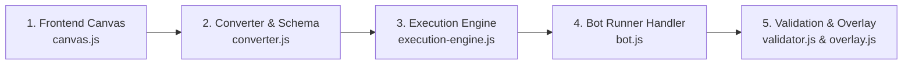

# 🛠️ คู่มือการเพิ่ม Action Node ชนิดใหม่ลงในระบบ (How to Add a New Action Node)

เอกสารนี้จัดทำขึ้นสำหรับ **นักพัฒนา (Developers)** ที่ต้องการสร้างและเพิ่ม **Action Node ชนิดใหม่** เข้าสู่ระบบ **NodeHotkey** ตั้งแต่ส่วนหน้าบ้าน (Visual Canvas) จนถึงระบบประมวลผลหลังบ้าน (Backend Execution Engine) อย่างเป็นระบบ Step-by-Step

---

## 🧭 ภาพรวมขั้นตอนการเพิ่มโหนดใหม่ (Workflow Overview)



---

## 📍 ตัวอย่างโจทย์: สมมุติเราจะเพิ่มโหนดใหม่ชื่อ `Mouse Click (เมาส์คลิกพิกัด X, Y)` (`mouse_click`)

---

### 🔹 ขั้นตอนที่ 1: ลงทะเบียนโหนดบน Visual Canvas ([public/js/canvas.js](file:///c:/Users/WADADADANG/Desktop/MyProjects/NodeHotkey/public/js/canvas.js))

1. **เพิ่ม Node Definition (ประเภทโหนด, สี, และพอร์ตเชื่อมต่อ):**
   ค้นหาฟังก์ชัน `createNode` หรือส่วนนิยาม Node Types:
   ```javascript
   case 'mouse_click':
     initialData = {
       x: 500,
       y: 500,
       button: 'left', // 'left', 'right', 'middle'
       clickCount: 1,
       targetClient: '1',
       delayAfter: 100,
       enabled: true
     };
     break;
   ```

2. **กำหนดพอร์ต Input / Output (Ports):**
   ```javascript
   // พอร์ตขาเข้า: รับสัญญาณจาก Trigger หรือโหนดก่อนหน้า
   inputs: [{ id: 'exec_in', label: 'In', type: 'execution' }]
      // พอร์ตขาออก: ส่งสัญญาณต่อไปยังโหนดถัดไปเมื่อคลิกเสร็จ
    outputs: [
      { id: 'next', label: 'Completed', type: 'execution' },
      { id: 'onCooldown', label: 'On Cooldown', type: 'execution' }, // 👈 พอร์ตเมื่อติด Skill Cooldown Guard
      { id: 'onError', label: 'Error', type: 'execution' }
    ]
    ```

3. **เพิ่มส่วนแสดงผลบนการ์ดโหนด (Node Card Body HTML):**
   ```javascript
   case 'mouse_click':
     return `
       <div class="node-field">
         <span>Target:</span> <strong>Client ${node.data?.targetClient || '1'}</strong>
       </div>
       <div class="node-field">
         <span>Coord:</span> <strong>(${node.data?.x || 0}, ${node.data?.y || 0})</strong> [${node.data?.button || 'Left'}]
       </div>
     `;
   ```

4. **เพิ่มช่องกรอกข้อมูลในแผงตั้งค่า (Inspector Properties Panel):**
   ค้นหาฟังก์ชัน `renderInspector(node)`:
   ```javascript
   if (node.type === 'mouse_click') {
     fieldsHtml += `
       <div class="inspector-group">
         <label>พิกัด X</label>
         <input type="number" class="inspector-input" value="${node.data.x}" onchange="updateNodeData('${node.id}', 'x', parseInt(this.value, 10))" />
         
         <label>พิกัด Y</label>
         <input type="number" class="inspector-input" value="${node.data.y}" onchange="updateNodeData('${node.id}', 'y', parseInt(this.value, 10))" />
         
         <label>ปุ่มเมาส์</label>
         <select class="inspector-input" onchange="updateNodeData('${node.id}', 'button', this.value)">
           <option value="left" ${node.data.button === 'left' ? 'selected' : ''}>คลิกซ้าย (Left)</option>
           <option value="right" ${node.data.button === 'right' ? 'selected' : ''}>คลิกขวา (Right)</option>
         </select>
       </div>
     `;
   }
   ```

---

### 🔹 ขั้นตอนที่ 2: แปลง Schema ข้อมูล ([converter.js](file:///c:/Users/WADADADANG/Desktop/MyProjects/NodeHotkey/converter.js))

แมปชื่อโหนดระหว่าง Visual Node กับ In-Memory Action Mode:
```javascript
const typeMap = {
  single_press: 'key_press',
  mouse_click: 'mouse_click', // 👈 เพิ่มตรงนี้
  delay_only: 'delay',
  forward: 'forwarder',
  ...
};
```

---

### 🔹 ขั้นตอนที่ 3: แมป Execution Graph ([execution-engine.js](file:///c:/Users/WADADADANG/Desktop/MyProjects/NodeHotkey/execution-engine.js))

ใน `buildInMemoryActions(profile)` เพิ่มการดึงค่าพารามิเตอร์ของโหนดเข้าสู่อ็อบเจ็กต์ Action:
```javascript
const modeMap = {
  key_press: 'single_press',
  mouse_click: 'mouse_click', // 👈 เพิ่มตรงนี้
  ...
};

// ใน Object action ที่ push:
actions.push({
  ...
  x: d.x !== undefined ? d.x : 0,
  y: d.y !== undefined ? d.y : 0,
  button: d.button || 'left',
  clickCount: d.clickCount || 1,
  ...
});
```

---

### 🔹 ขั้นตอนที่ 4: เขียนฟังก์ชันประมวลผลคำสั่งใน Engine ([bot.js](file:///c:/Users/WADADADANG/Desktop/MyProjects/NodeHotkey/bot.js))

1. **สร้างฟังก์ชัน Runner:**
   ```javascript
   async function runMouseClickAction(action, callStack) {
     if (global.isSuspended) return;
     const target = action.targetClient || '1';
     const targets = getActionTargets(target).map(x => parseInt(x, 10));
     
     console.log(`🖱️ [Action] Mouse Click (${action.x}, ${action.y}) on Client ${target}`);
     
     for (let t of targets) {
       const page = clientPages[t];
       if (!page) continue;
       try {
         await page.mouse.click(action.x, action.y, { button: action.button || 'left' });
       } catch (err) {
         console.error(`[Mouse Click Error] Client ${t}:`, err.message);
         await fireChain(action, 'onError', callStack);
         return;
       }
     }
     
     const delayAfter = parseInt(action.delayAfter, 10) || 0;
     if (delayAfter > 0) {
       await new Promise(res => setTimeout(res, delayAfter));
     }
     
     // ส่งสัญญาณไปยังโหนดถัดไปที่ต่อสายไว้
     await fireChain(action, 'onComplete', callStack);
     sendOverlayUpdate();
   }
   ```

2. **เชื่อมโยงเข้ากับ `handleActionTrigger` ใน [bot.js](file:///c:/Users/WADADADANG/Desktop/MyProjects/NodeHotkey/bot.js):**
   ```javascript
   switch (action.mode) {
     case 'single_press':
       runSinglePressAction(action, callStack);
       break;
     case 'mouse_click': // 👈 เพิ่ม Case เรียกฟังก์ชัน
       runMouseClickAction(action, callStack);
       break;
     case 'loop':
       ...
   }
   ```

---

### 🔹 ขั้นตอนที่ 5: การตรวจสอบความถูกต้องและการแสดงผล Overlay ([validator.js](file:///c:/Users/WADADADANG/Desktop/MyProjects/NodeHotkey/public/js/validator.js) & [launcher/ui/overlay.js](file:///c:/Users/WADADADANG/Desktop/MyProjects/NodeHotkey/launcher/ui/overlay.js))

1. **ใน `validator.js`:** เพิ่มเงื่อนไขตรวจสอบ เช่น ถ้าไม่ได้ใส่พิกัด X/Y ให้ขึ้นแจ้งเตือน:
   ```javascript
   if (normMode === 'mouse_click') {
     if (act.x === undefined || act.y === undefined) {
       issues.push({
         type: 'unset_target',
         severity: 'warning',
         actionId: act.id,
         actionName: act.name,
         messageEn: 'Mouse Click action has invalid X/Y coordinates.',
         messageTh: 'โหนด Mouse Click ยังไม่ได้ระบุพิกัด X หรือ Y'
       });
     }
   }
   ```

2. **ใน `launcher/ui/overlay.js`:** กำหนดไอคอนและคลาสสีที่จะแสดงบนหน้าต่าง HUD:
   ```javascript
   case 'mouse_click':
     return { icon: '🖱️', text: 'Clicking', className: 'mouse' };
   ```

---

### 🔹 ขั้นตอนที่ 6: จัดการวงจรการหยุดทำงาน (Lifecycle & Stop Handlers)

หากโหนดที่สร้างขึ้นเป็นประเภท **การทำงานต่อเนื่อง (Loop / Multi-Timer / Continuous Async)**:

1. **สร้าง Cancellation Token หรือ State Dictionary ใน `bot.js`**:
   - ประกาศตัวแปร State ที่ **ส่วนหัวของไฟล์ `bot.js`** (Top-level globals) เสมอ
   ```javascript
   let activeMyActionStates = {};
   let myActionTokens = {};
   global.activeMyActionStates = activeMyActionStates;
   global.myActionTokens = myActionTokens;
   ```

2. **เขียนฟังก์ชันสั่งหยุด `stopMyAction(actionId, actionName)`**:
   ```javascript
   function stopMyAction(actionId, actionName) {
     myActionTokens[actionId] = (myActionTokens[actionId] || 0) + 1;
     const state = activeMyActionStates[actionId];
     if (state) {
       state.running = false;
       if (state.timeout) clearTimeout(state.timeout);
       const act = activeActions.find(a => a.id === actionId);
       if (act) fireChain(act, 'onStop');
     }
     sendOverlayUpdate();
   }
   ```

3. **ลงทะเบียนใน `stopAllLoops()` และ `stopLoopsForClient(clientIndex)`**:
   - เพื่อให้เวลาผู้ใช้กดปุ่ม `END` (Emergency Suspend / Stop All) หรือคำสั่งหยุดเฉพาะจอ ระบบจะสั่งหยุดโหนดนี้ด้วยเสมอ
   ```javascript
   // ใน stopAllLoops()
   } else if (act.mode === 'my_action') {
       stopMyAction(act.id, act.name);
   }
   ```

4. **ลงทะเบียนใน `runEmergencyStopAction()` และ `getClientStatuses()`**:
   - เพื่อให้หน้าต่าง **Overlay HUD** แสดงและเคลียร์สถานะได้อย่างถูกต้องแบบ Real-time

---

## ✅ สรุป Checklist สำหรับนักพัฒนา
- [ ] เพิ่ม Definition & UI Component ใน `public/js/canvas.js`
- [ ] เพิ่ม Type Map ใน `converter.js`
- [ ] เพิ่ม Schema Field ใน `execution-engine.js`
- [ ] เขียนฟังก์ชัน Execute และเรียก `fireChain()` ใน `bot.js`
- [ ] หากเป็น Continuous Action: เขียน `stopAction()`, ลงทะเบียนใน `stopAllLoops()` และ `getClientStatuses()`
- [ ] เพิ่ม Rule ตรวจสอบใน `public/js/validator.js`

