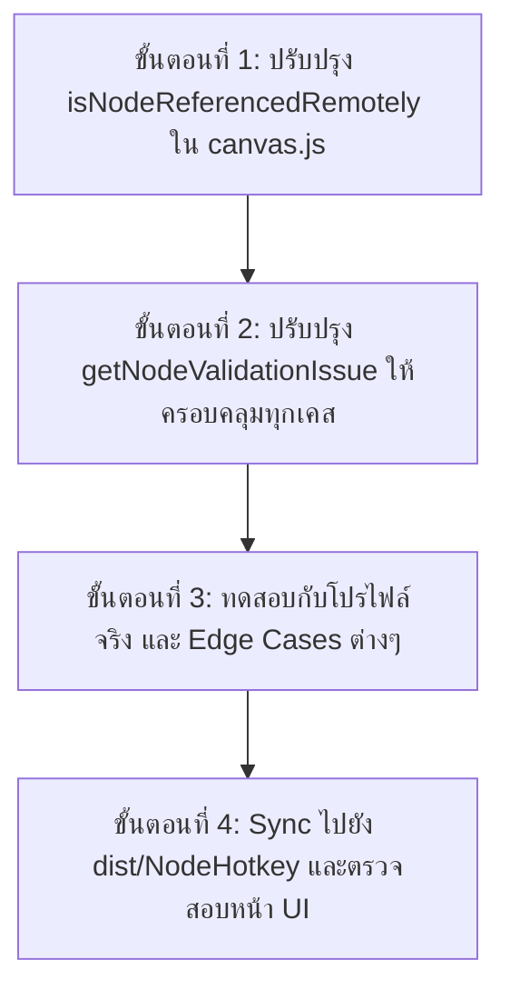

# 📋 แผนการปรับปรุงระบบ Node Validation & ป้องกันการแจ้งเตือนผิดพลาด (Smart Validation Plan)

เอกสารนี้รวบรวมแผนการปรับปรุงระบบตรวจสอบความถูกต้องของ Node Graph และ Action List ใน **NodeHotkey** เพื่อป้องกันการแจ้งเตือน **False-Positive (เตือนผิดพลาด/แจ้งเตือนหลอกตา)** สำหรับกรณีที่ผู้ใช้ตั้งค่าและเชื่อมต่อทำงานถูกต้องตามหลักการอยู่แล้ว

---

## 🎯 วัตถุประสงค์หลัก
1. แจ้งเตือนข้อผิดพลาดที่เกิดขึ้นจริงเท่านั้น (**True Errors/Warnings**) เช่น ลืมใส่ปุ่มคีย์, ลืมใส่ชื่อ Event, หรือโหนดที่วางลอยโดยไม่มีการเชื่อมโยงใดๆ
2. ยกเว้นการแจ้งเตือนในกรณีที่โหนดทำงานผ่านระบบคำสั่งไร้สาย, Chaining, Built-in Trigger หรือ Standalone System Nodes เพื่อไม่ให้ผู้ใช้งานสับสน
3. แสดงผล UI แบบ Real-time ตามมาตรฐาน **Unreal Engine Blueprints** (แถบ `ERROR!` / `WARNING!` แนบขอบล่าง + ป้ายข้อความลอย)

---

## 📑 รายการตรวจสอบและแก้ไข (Checklist & Action Items)

### 🔹 ส่วนที่ 1: ระบบ Action Chaining แบบหลายพอร์ต (Unreal Multi-Pin Execution Ports)
- [x] **1.1 เพิ่มพอร์ตเชื่อมต่อ Execution หลายจุดบน Node เหมือน Unreal Engine**
  - **สำหรับโหนด `Loop`**:
    - 🔵 `Loop Body (on_interval)`: ส่งสัญญาณทุกๆ รอบที่วนลูปกดปุ่ม
    - 🟢 `Completed (on_complete)`: ส่งสัญญาณเมื่อลูปหยุดทำงานหรือทำงานครบ
  - **สำหรับโหนด `Buff Sequence / Key Press / Delay`**:
    - 🟢 `Completed (on_complete / next)`: ส่งสัญญาณเมื่อกดสกิลหรือหน่วงเวลาเสร็จสิ้น
  - **สำหรับโหนด `Branch (Condition)`**:
    - 🟢 `True (on_true)`: เงื่อนไขเป็นจริง
    - 🔴 `False (on_false)`: เงื่อนไขเป็นเท็จ
- [x] **1.2 การตรวจจับความถูกต้องของสายเชื่อมต่อ (Smart Connection Validation)**
  - โหนดใดก็ตามที่มีสายลากมาจากพอร์ตใดพอร์ตหนึ่งข้างต้น ➔ **ถือว่ามีสัญญาณเข้า (`exec_in`) สมบูรณ์ 100% ไม่เตือน Warning**
  - โหนดที่ถูกระบุใน `chaining` ภายในข้อมูลโปรไฟล์ (`onComplete`, `onInterval`, `onStart`, `onStop`, `onTrue`, `onFalse`) ➔ **ถือว่าเชื่อมต่อสมบูรณ์ ไม่เตือน Warning**
- [x] **1.3 รองรับ Action Control (`controlTargetIds`)**
  - ตรวจจับว่าหาก Action ถูกควบคุมโดยโหนด `Action Control` (สั่ง Start/Stop/Toggle)
  - **ผลลัพธ์**: ไม่ต้องมีสายต่อเข้าหัว `exec_in` และไม่ขึ้นเตือน Warning
- [x] **1.4 รองรับ Branch / Condition (`conditionTargetId`)**
  - ตรวจจับว่าหาก Action ถูกใช้เป็นตัวอ้างอิงตรวจสอบสถานะโดยโหนด `Branch`
  - **ผลลัพธ์**: ไม่ต้องมีสายต่อเข้าหัว `exec_in` และไม่ขึ้นเตือน Warning

---

### 🔹 ส่วนที่ 2: โหนดคำสั่งระบบอิสระและ End-point Nodes (Stand-alone & Terminal Nodes)
- [ ] **2.1 โหนด `Action Control` (`control`)**
  - เป็นโหนดสั่งการอิสระ ไม่จำเป็นต้องมีสายต่อเข้า `exec_in`
  - หากไม่ได้เลือก Target ให้ถือเป็นการสั่ง "All Actions" โดยไม่ขึ้นเตือน
- [ ] **2.2 โหนด `Emergency Stop` (`emergency_stop`)**
  - เป็นโหนด Panic Kill-Switch ระดับระบบ ไม่จำเป็นต้องมีสายต่อเข้า และไม่มีสายต่อออก
- [ ] **2.3 โหนด `Emit Event` (`emit_event`)**
  - เป็นโหนดส่งสัญญาณ Broadcast ปลายทาง ไม่จำเป็นต้องมีสายต่อออก (`next`)

---

### 🔹 ส่วนที่ 3: โหนดที่มี Trigger ในตัวเอง (Self-Triggered Actions)
- [ ] **3.1 Action ที่มีปุ่ม Hotkey ในตัวเอง (`act.trigger.value`)**
  - กรณีสลับมาจาก Action List หรือตั้งปุ่ม Hotkey ไว้ในการ์ดของตัวเองโดยตรง
  - **ผลลัพธ์**: สามารถทำงานได้เองเมื่อกดปุ่ม ไม่จำเป็นต้องมีโหนด Trigger แยกมาโยงสายเข้า

---

### 🔹 ส่วนที่ 4: ค่าพารามิเตอร์เริ่มต้นที่ถูกต้องตามระบบ (Valid Defaults)
- [ ] **4.1 Target Clients แบบค่าเริ่มต้น (All Clients)**
  - การไม่ระบุจอ หรือเลือก `targetClient: "all"` / ว่าง ถือเป็นการส่งคำสั่งทุกจอ ไม่ต้องแจ้งเตือน
- [ ] **4.2 Skill Cooldown Guard แบบใช้ค่า Preset**
  - เมื่อเลือก Preset สกิลเกมแล้ว การปล่อยให้ช่อง `Custom Cooldown (ms)` เป็น 0 หรือว่าง ถือว่าถูกต้องตาม Cooldown สกิลจริง ไม่ต้องแจ้งเตือน

---

### 🔹 ส่วนที่ 5: สถานะโหนดที่ปิดใช้งาน (Disabled / Draft Nodes)
- [ ] **5.1 โหนดที่ `enabled: false`**
  - โหนดที่ผู้ใช้จงใจติ๊กปิดการทำงานชั่วคราว ไม่ต้องแสดงแถบเตือนสีส้ม/แดง เพื่อไม่ให้รบกวนสายตา

---

## 🛠️ แผนการดำเนินการทีละขั้นตอน (Step-by-Step Implementation)

1. **ขั้นตอนที่ 1**: ปรับปรุงฟังก์ชัน `isNodeReferencedRemotely(node)` ใน `public/js/canvas.js` ให้ครอบคลุมทั้ง Chaining (`onComplete`, `onInterval`, `onStart`, `onStop`, `onTrue`, `onFalse`), Action Control, และ Branch Condition
2. **ขั้นตอนที่ 2**: ปรับปรุงฟังก์ชัน `getNodeValidationIssue(node)` ให้ตรวจจับ Built-in Trigger, Standalone Nodes (`control`, `emergency_stop`, `emit_event`), และ Preset Cooldown
3. **ขั้นตอนที่ 3**: ทดสอบการแสดงผลบนหน้า Canvas กับเคสปกติ และเคสที่มีข้อผิดพลาดจริง
4. **ขั้นตอนที่ 4**: ทำการ Sync ไฟล์ไปยัง Build Bundle และสรุปผล

---
*เอกสารนี้สร้างเมื่อ: 2026-08-15*
