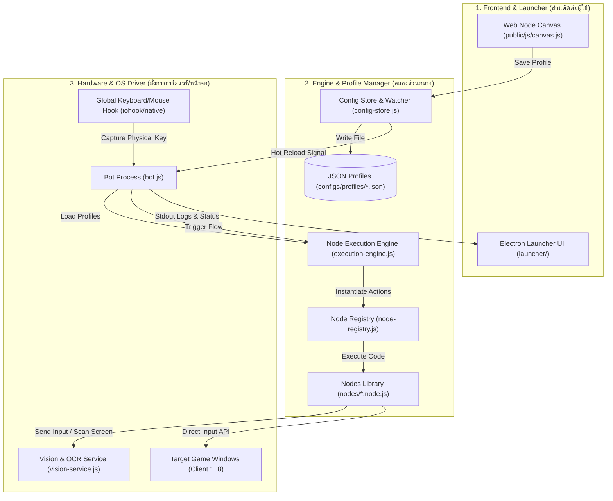
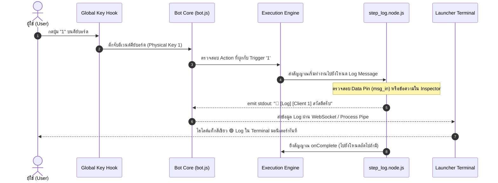

# 🧭 แผนผังและสถาปัตยกรรมระบบ NodeHotkey v3.1.0
*(System Architecture & Technical Overview)*

เอกสารนี้รวบรวมและสรุปโครงสร้างการทำงานทั้งหมดของโปรเจกต์ **NodeHotkey** ไว้อย่างครบถ้วน เพื่อให้คุณและทีมงาน (รวมถึง AI ในอนาคต) เข้าใจภาพรวมของระบบได้ทันทีโดยไม่ต้องเปิดไล่อ่านโค้ดทั้งหมด

---

## 🎯 1. NodeHotkey คืออะไร? (ภาพรวมระดับสูง)
**NodeHotkey** เป็นระบบ **Automation & Multi-Client Hotkey Orchestrator** บน Windows:
- มี **Visual Node Canvas Editor** (หน้าเว็บวาดโหนดสไตล์ Unreal Engine Blueprints) เพื่อให้ผู้ใช้ออกแบบตรรกะการกดคีย์/วนลูป/ตรวจจับภาพได้อย่างอิสระ
- มี **Electron Launcher UI** ทำหน้าที่เป็นศูนย์ควบคุม (หน้าจอหลัก, แสดงสถานะ Client, มอนิเตอร์ Log แยกประเภท, ปุ่มเปิด/ปิด และระบบอัปเดตอัตโนมัติ)
- มี **Modular Bot Engine** หลังบ้านที่รันด้วย Node.js ประมวลผลกราฟการเชื่อมต่อในเสี้ยววินาที และยิงสัญญาณควบคุมไปยังหน้าต่างเกม/โปรแกรมต่างๆ

---

## 🏗️ 2. สถาปัตยกรรม 3 เลเยอร์หลัก (Core Layers)



---

## ⚡ 3. วงจรชีวิตเมื่อผู้ใช้กดปุ่มคีย์บอร์ด 1 ครั้ง (Execution Flow)

ตัวอย่าง: ผู้ใช้ตั้งค่าโหนด **Trigger (Key 1)** ต่อเข้ากับโหนด **Log Message ("สวัสดีครับ")**



---

## 🔗 4. ระบบการเชื่อมต่อสาย (Wire Routing System)

NodeHotkey ใช้ระบบเชื่อมต่อแบบสองประเภทเลียนแบบ Unreal Engine:

### 1. สายสีฟ้า (Execution Flow Wires)
- **พอร์ต**: `exec_out` ➔ `exec_in` (หรือ `onComplete`, `onSuccess`, `onFail`, `onTrue`, `onFalse`)
- **หน้าที่**: กำหนด **"ลำดับเวลา"** ว่าอะไรต้องทำก่อน-หลัง (Control Flow)
- **ตัวอย่าง**: เมื่อ Trigger ทำงาน ➔ วิ่งไปกดสกิล 1 ➔ รอ 500ms ➔ วิ่งไปกดสกิล 2

### 2. สายสีชมพู (Data Wires / Unreal-style Pins)
- **พอร์ต**: `val_out` ➔ `val_in` หรือ `msg_in`
- **หน้าที่**: ส่งผ่าน **"ข้อมูล/ตัวแปร"** (Value Flow) โดยไม่ต้องมีลำดับเวลา
- **ตัวอย่าง**:
  - โหนด **Get Variable (`var_get`)** ส่งค่าตัวแปร (เช่น `"PHASE_2"`) ผ่านสายสีชมพู
  - เข้าสู่ขา **Message (`msg_in`)** ของโหนด **Log Message (`step_log`)** เพื่อนำค่าตัวแปรไปพิมพ์ลงจอมอนิเตอร์แบบ Real-time

---

## 🧩 5. โหนดหลักในระบบ (Key Modular Nodes)

| ไอคอน | ประเภทโหนด (`type`) | ไฟล์ต้นทาง | หน้าที่ |
| :---: | :--- | :--- | :--- |
| ⚡ | **trigger** | `nodes/trigger.node.js` | ดักจับปุ่มกดคีย์บอร์ด/เมาส์ เป็นจุดเริ่มต้นของ Workflow |
| ⌨️ | **key_press** | `nodes/key_press.node.js` | ส่งการกดปุ่มคีย์บอร์ดไปยังจอ Client ที่ระบุ |
| 🔁 | **loop** | `nodes/loop.node.js` | วนลูปส่งคีย์ตามช่วงเวลา (Interval + Jitter) |
| 📝 | **step_log** | `nodes/step_log.node.js` | พิมพ์ข้อความบันทึก (Print Log) ลงใน Terminal แยกหมวดหมู่ชัดเจน |
| 🧩 | **format_text** | `nodes/format_text.node.js` | รวม/จัดรูปแบบข้อความ ตัวเลข บูลีน (Boolean to String) ผ่าน Data Pins |
| 🔘 | **var_get** | `nodes/var_get.node.js` | ดึงค่าตัวแปรในระบบ (Pure Node) ส่งออกผ่านสายสีชมพู |
| ⚙️ | **var_set** | `nodes/var_set.node.js` | กำหนด/เปลี่ยนค่าตัวแปร (Set Value, Toggle, Increment) |
| 🩺 | **party_heal / buff** | `party-target-handler.js` | สแกนหลอดเลือดสมาชิกในตี้และสั่งฮีล/บัฟอัตโนมัติ |
| 📸 | **screenshot** | `nodes/screenshot.node.js` | ถ่ายภาพหน้าจอของจอเกมเพื่อวิเคราะห์หรือบันทึกข้อผิดพลาด |
| 🗣️ | **tts** | `tts-service.js` | ส่งเสียงพูดแจ้งเตือนผ่าน Microsoft Azure / Edge TTS ภาษาไทย |

---

## 📁 6. แผนที่โครงสร้างโฟลเดอร์และหน้าที่ของแต่ละไฟล์ (Directory Map)

```text
NodeHotkey/
├── launcher/                  # ศูนย์กลางโปรแกรม Launcher (Electron)
│   ├── main.js                # กระบวนการหลักของ Electron (หน้าต่าง, Hotkeys, Updater)
│   └── ui/                    # หน้ากากโปรแกรม (HTML, CSS, JS ของ Launcher)
│       ├── index.html         # โครงสร้างหน้าต่าง Launcher
│       ├── launcher.css       # ดีไซน์ Dark Theme พรีเมียม และ Terminal Styling
│       └── launcher.js        # ตรรกะฝั่ง UI (รับ Log, ปุ่มสวิตช์ Client, สถิติ)
│
├── public/                    # ส่วนเว็บหน้าบ้านของ Canvas Editor
│   ├── index.html             # หน้าเว็บ Node Canvas
│   ├── css/canvas.css         # สไตล์โหนด, สายไฟ (Wires), พอร์ตเชื่อมต่อ
│   └── js/
│       ├── canvas.js              # หัวใจหลักของ Canvas (Pan/Zoom, วาดโหนด, ลากสายไฟ Wires)
│       ├── canvas-inspector.js   # แผงตั้งค่า Inspector ทางขวาและฟอร์มของโหนดทั้งหมด
│       ├── canvas-serializer.js  # ตัวแปลงและบันทึกข้อมูลโปรไฟล์ JSON (exportProfileData)
│       ├── i18n.js                # ระบบสองภาษา (ไทย / English)
│       └── state.js               # จัดการสถานะและ Undo/Redo ในหน้า Canvas
│
├── nodes/                     # คลังโหนดแบบโมดูลาร์ (แยก 1 ไฟล์ = 1 โหนด)
│   ├── trigger.node.js        # โหนด Trigger
│   ├── step_log.node.js       # โหนด Log Message
│   ├── var_get.node.js        # โหนดอ่านตัวแปร
│   ├── var_set.node.js        # โหนดตั้งค่าตัวแปร
│   └── ...                    # โหนดฟังก์ชันอื่นๆ
│
├── configs/                   # ที่เก็บการตั้งค่าและโปรไฟล์ทั้งหมด
│   ├── global.json            # การตั้งค่าส่วนกลาง (คีย์ลัด Pause, หน้าจอ ฯลฯ)
│   └── profiles/              # ไฟล์ JSON ของแต่ละโปรไฟล์ (เช่น Test1.json, Test3.json)
│
├── bot.js                     # เครื่องจักรบอทหลังบ้าน (รัน Process แยกกับ Launcher)
├── execution-engine.js        # ตัวแปลงกราฟ Node เป็น In-Memory Actions และยิงกระแสสัญญาณ
├── node-registry.js           # ตัวโหลดโหนดทั้งหมดในโฟลเดอร์ nodes/ เข้าสู่ระบบ
├── config-store.js            # ระบบจัดการไฟล์โปรไฟล์และ File Watcher ตรวจจับการแก้ไฟล์
├── vision-service.js          # บริการสแกนภาพและ OCR หลอดเลือด/สถานะบนจอเกม
└── docs/                      # เอกสารคู่มือและสถาปัตยกรรมระบบ
    └── SYSTEM_ARCHITECTURE.md # เอกสารฉบับนี้
```

---

## 🛡️ 7. การป้องกันระบบพังด้วย Automated Tests
เมื่อมีการแก้ไขโค้ดใหม่ สามารถรันคำสั่งนี้ใน Terminal เพื่อให้มั่นใจว่าระบบทั้งหมดยังคงทำงานถูกต้อง 100%:

```powershell
npm test
```
**ชุดการทดสอบครอบคลุม:**
1. `converter.test.js` - ทดสอบการแปลงโปรไฟล์เวอร์ชันเก่าเป็นเวอร์ชันใหม่
2. `watcher.test.js` - ทดสอบระบบตรวจจับการแก้ไขไฟล์โปรไฟล์จากภายนอก
3. `step_and_vars.test.js` - ทดสอบระบบตัวแปร Data Pins, การปรินต์ Log Message และตัวกรอง Log
4. `updater.test.js` - ทดสอบระบบวิเคราะห์ผลกระทบการอัปเดตอัตโนมัติ

---
*จัดทำขึ้นเพื่อให้การพัฒนาต่อยอด NodeHotkey เป็นไปอย่างแม่นยำ รวดเร็ว และเป็นระบบระเบียบสูงสุด*
